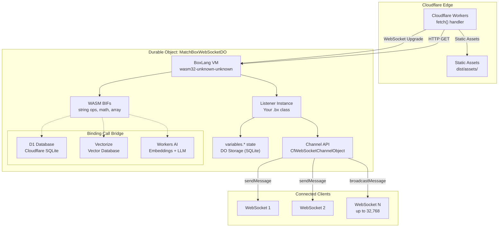
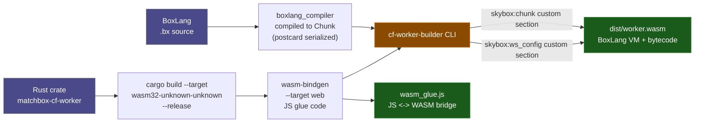
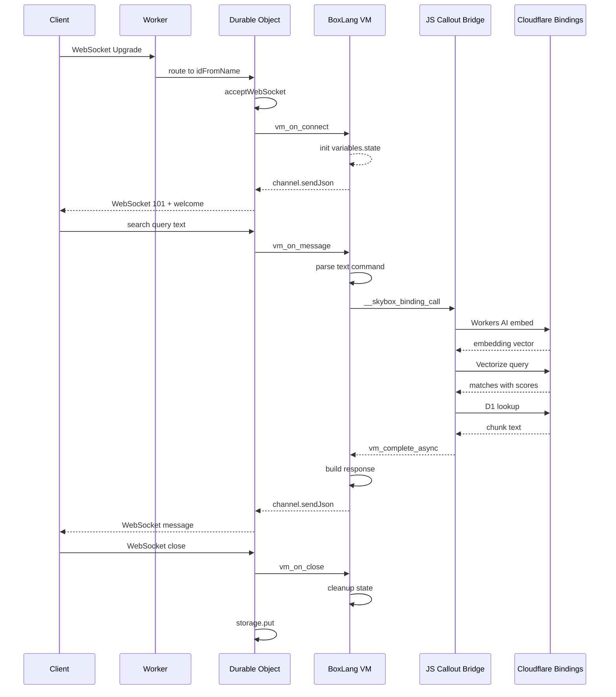

# SkyBox

BoxLang on Cloudflare Workers — compile [BoxLang](https://boxlang.io) `.bx` source files into WebAssembly and deploy them at the edge with Durable Object persistence, Hibernation API, and near-zero cold starts.

> **Work in Progress**: SkyBox is under active development. APIs, build pipeline, and documentation may change. See [known issues](https://github.com/r3c0nc1l3r/SkyBox/issues) and the [CHANGELOG](CHANGELOG.md).

## Live Demos

| Demo | URL | Description |
|------|-----|-------------|
| **BoxDox** | [skybox-boxdox.codetek.us](https://skybox-boxdox.codetek.us) | BoxLang documentation viewer with AI chat and semantic search |
| **SkyChat** | [skybox-skychat.codetek.us](https://skybox-skychat.codetek.us) | RAG-powered AI chat with OpenRouter |
| **ChatRoom** | [skybox-chatroom.codetek.us](https://skybox-chatroom.codetek.us) | Multi-client chat room with Web UI |
| **MoonPhase** | [skybox-moonphase.codetek.us](https://skybox-moonphase.codetek.us) | Moon phase calculator |
| **Todo** | [skybox-todo.codetek.us](https://skybox-todo.codetek.us) | Collaborative todo list with REST API |
| **RomanNumeral** | [skybox-romannumeral.codetek.us](https://skybox-romannumeral.codetek.us) | Roman numeral ↔ integer converter |
| **JsonFmt** | [skybox-jsonfmt.codetek.us](https://skybox-jsonfmt.codetek.us) | JSON validator and formatter |
| **TextAnalyzer** | [skybox-textanalyzer.codetek.us](https://skybox-textanalyzer.codetek.us) | Word/sentence frequency analyzer |

## Architecture



## Build Pipeline



## Data Flow (WebSocket)



## Quick Start

### 1. Prerequisites

```bash
rustup target add wasm32-unknown-unknown
cargo install wasm-bindgen-cli --version 0.2.114
npm install -g wrangler
```

### 2. Write a Listener

```boxlang
// MyListener.bx
class MyListener {
    function onConnect(required channel) {
        channel.sendMessage("Welcome!");
    }
    function onMessage(required message, required channel) {
        channel.sendMessage("echo:" & message);
    }
    function onClose(required channel) {}
}
```

### 3. Build

```bash
cd crates/matchbox-cf-worker
bash examples/build.sh examples/myapp examples/myapp/MyListener.bx MyListener
```

### 4. Deploy

```bash
cd examples/myapp
npx wrangler deploy
```

## Project Structure

```
SkyBox/
├── crates/
│   ├── matchbox-cf-worker/        # Rust crate: the BoxLang VM adapted for CF Workers
│   │   ├── src/
│   │   │   ├── lib.rs             # Crate root: module declarations
│   │   │   ├── types.rs           # Core types: WebSocketConfig, RequestData, CalloutMessage
│   │   │   ├── channel.rs         # CfWebSocketChannelObject (BxNativeObject impl)
│   │   │   ├── do_adapter.rs      # DO state persistence + JS callout bridge
│   │   │   ├── bifs.rs            # WASM-compatible BIF implementations
│   │   │   ├── wasm_exports.rs    # #[wasm_bindgen] exported functions
│   │   │   ├── wasm_metadata.rs   # WASM custom section read/write
│   │   │   └── build.rs           # Build script
│   │   ├── shell/
│   │   │   ├── mcf-worker.js      # Template: Worker entry point + DO class
│   │   │   └── wrangler.toml      # Template: Cloudflare Worker config
│   └── cf-worker-builder/         # CLI: compiles .bx → bytecode, embeds in WASM
│
├── examples/                      # Demo apps (live at *.codetek.us)
│   ├── boxdox/                    # BoxLang documentation viewer with AI chat
│   ├── chatroom/                  # Multi-client chat (Web UI + WebSocket)
│   ├── counter/                   # Stateful click counter (broadcast)
│   ├── echo/                      # Basic echo server (WebSocket)
│   ├── jsonfmt/                   # JSON validator (manual parsing)
│   ├── moonphase/                 # Moon phase calculator
│   ├── romannumeral/              # Roman numeral converter
│   ├── skychat/                   # RAG-powered AI chat with OpenRouter
│   ├── textanalyzer/              # Word/sentence frequency analyzer
│   └── todo/                      # Collaborative todo list (HTTP REST API)
│
├── packages/mx-ai/                # MatchBox AI module (port of bx-ai BIFs to WASM)
├── skybox-cli/                    # CommandBox module for scaffolding/deploying
├── vendor/matchbox/               # MatchBox BoxLang runtime (git submodule)
├── refs/
│   ├── bx-ai/                     # BoxLang AI reference (git submodule)
│   └── bx-demos/                  # BoxLang demo apps reference (git submodule)
├── docs/                          # Documentation site (Astro/Starlight)
└── scripts/apply-patches.sh       # Apply vendor patches before build
```

## Code Walkthrough

### Rust Crate (`crates/matchbox-cf-worker/src/`)

The core crate compiles to `wasm32-unknown-unknown` and implements:

| File | Purpose |
|------|---------|
| `lib.rs` | Module declarations; `cdylib` + `rlib` crate types |
| `types.rs` | `WebSocketConfig` (app config), `RequestData` (request metadata), `CalloutMessage` (JS bridge message) |
| `channel.rs` | `CfWebSocketChannelObject` — implements the BoxLang channel API (`sendMessage`, `sendJson`, `broadcastMessage`, `close`, `getId`, etc.) as a `BxNativeObject` |
| `do_adapter.rs` | `DoState` — persists `variables.*` state to DO storage via `__skybox_get_state`/`__skybox_set_state` callouts. `CalloutBridge` — routes `d1Query`, `d1Execute`, `mxaiVectorizeUpsert`, `openRouterChat` etc. calls through the JS callout bridge |
| `bifs.rs` | WASM-compatible BIF implementations for operations like `mxaiEmbed`, `mxaiVectorizeQuery`, `d1Query`, `d1Execute`, `openRouterChat` |
| `wasm_exports.rs` | Functions exported to JS via `#[wasm_bindgen]`: `vm_init`, `vm_on_connect`, `vm_on_message`, `vm_on_close`, `vm_on_http_request`, `vm_complete_async`, `vm_set_state`, `vm_get_state`, `vm_register_connection` |
| `wasm_metadata.rs` | Reads WASM custom sections (`skybox:chunk` for bytecode, `skybox:ws_config` for config) |

### JS Shell (`shell/mcf-worker.js`)

The JS shell has two exports:

1. **`default { fetch }`** — The stateless Worker entry point. Routes WebSocket upgrades to the DO, handles HTTP requests.

2. **`MatchBoxWebSocketDO`** — The Durable Object class that:
   - Initializes the BoxLang VM from WASM custom sections
   - Manages WebSocket connections via the Hibernation API
   - Handles the **async pause/resume cycle**: when the BoxLang VM performs an async operation (D1 query, Vectorize search, AI embed), it yields (`__paused__`), the JS shell awaits the promise, then resumes via `vm_complete_async()`
   - Implements the **Binding Call Dispatch** — routes calls from BoxLang BIFs to Cloudflare bindings (D1, Vectorize, Workers AI, OpenRouter, Turso)

Global callout handlers:
- `__skybox_send` — Send message to a specific connection (supports SSE + WebSocket fallback)
- `__skybox_broadcast` — Broadcast to all connections except sender
- `__skybox_close` — Close a specific connection
- `__skybox_binding_call` — Route async binding operations (D1 query/execute, embed, Vectorize upsert/query, OpenRouter chat, Turso operations)

#### SSE Architecture

The shell template (`shell/mcf-worker.js`) uses **module-level SSE streams** (`globalSSEStreams` Map) accessible to both the Worker entry point (for SSE creation) and DO callouts (for SSE writes). The production examples use **DO-level SSE streams** stored on `this.sseStreams` — each approach works depending on whether the Worker and DO share module scope.

### BoxLang Listener API

Listeners are simple BoxLang classes with lifecycle hooks:

```boxlang
class MyListener {
    // Required: called when a WebSocket connects
    function onConnect(required channel) { }

    // Required: called when a text/binary message arrives
    function onMessage(required message, required channel) { }

    // Required: called when a WebSocket closes
    function onClose(required channel) { }

    // Optional: handles HTTP GET requests (returns {status, headers, body})
    function onHttpGet(required struct request) { }
}
```

### WASM BIF Constraints

Since `deserializeJSON`, `int()`, `reReplace`, etc. are **not available** on `wasm32-unknown-unknown`, all examples use text-based command protocols and manual string iteration. See `crates/matchbox-cf-worker/README.md` for the full BIF availability table.

### Binding Call BIFs (Cloudflare-specific)

These BIFs are implemented via the JS callout bridge and are available in the WASM runtime:

| BIF | Purpose | Backend |
|-----|---------|---------|
| `d1Query(binding, sql, [params])` | SELECT queries | Cloudflare D1 |
| `d1Execute(binding, sql, [params])` | INSERT/UPDATE/DELETE | Cloudflare D1 |
| `mxaiEmbed(input)` | Generate embeddings | Workers AI (BGE model) |
| `mxaiVectorizeUpsert(binding, vectorsJson)` | Store vectors | Cloudflare Vectorize |
| `mxaiVectorizeQuery(binding, vectorJson, topK, filter)` | Semantic search | Cloudflare Vectorize |
| `openRouterChat(binding, messagesJson, userId, prompt)` | AI chat streaming | OpenRouter API |
| `tursoQuery(sql, [params])` | SELECT queries | Turso (libSQL) |
| `tursoExecute(sql, [params])` | INSERT/UPDATE/DELETE | Turso (libSQL) |

These all use the **async pause/resume cycle**: the BoxLang VM pauses execution, the JS shell resolves the promise, then the VM resumes with the result.

## Naming Convention

All deployed Cloudflare Workers follow: **`skybox-<app>`**

- `skybox-chatroom`, `skybox-todo`, `skybox-echo`, `skybox-boxdox`, `skybox-skychat`
- The `box skybox init` command auto-prepends `skybox-` when scaffolding

## Source Demos

Source demos live in `examples/` and are deployed to Cloudflare Workers:

| Demo | Description | Protocol | URL |
|------|-------------|----------|-----|
| **echo** | Basic echo server | WebSocket text | -- |
| **counter** | Stateful counter with broadcast | WebSocket JSON | -- |
| **chatroom** | Multi-client chat with Web UI | WebSocket + Static Assets | [skybox-chatroom.codetek.us](https://skybox-chatroom.codetek.us) |
| **moonphase** | Moon phase calculator | WebSocket JSON | [skybox-moonphase.codetek.us](https://skybox-moonphase.codetek.us) |
| **romannumeral** | Roman numeral ↔ integer converter | WebSocket text | [skybox-romannumeral.codetek.us](https://skybox-romannumeral.codetek.us) |
| **jsonfmt** | JSON validator (manual, no `deserializeJSON`) | WebSocket text | [skybox-jsonfmt.codetek.us](https://skybox-jsonfmt.codetek.us) |
| **textanalyzer** | Word/sentence frequency analyzer | WebSocket text | [skybox-textanalyzer.codetek.us](https://skybox-textanalyzer.codetek.us) |
| **todo** | Collaborative todo list (HTTP API + HTML UI) | HTTP REST | [skybox-todo.codetek.us](https://skybox-todo.codetek.us) |

## Deployment

```bash
# Build
npm run build

# Upload version (does NOT switch traffic)
npx wrangler versions upload

# Deploy version to 100% of traffic
npx wrangler versions deploy --version-id <id> --percentage 100

# Or use the shortcut (wrangler < v4):
npx wrangler deploy
```

> **Note**: In wrangler v4+, `wrangler deploy` only uploads but doesn't switch traffic. You must use `wrangler versions deploy` to make it live.

## Development Notes

### Mermaid Diagrams

Diagrams are rendered with [Mermaid.js](https://mermaid.js.org/). To validate changes locally:

```bash
npx @mermaid-js/mermaid-cli -i diagram.mmd -o diagram.png
```

Common pitfalls:
- Avoid edges that reference subgraph IDs directly (point to nodes instead)
- Use `<br/>` or `\n` for line breaks in node labels — both work in most renderers
- Avoid unicode escapes like `\u2194` — use the literal character or text like `<->`
- Parentheses `()` and special chars in participant aliases should be avoided in sequence diagrams

## License

MIT — see [LICENSE](LICENSE) for details.
